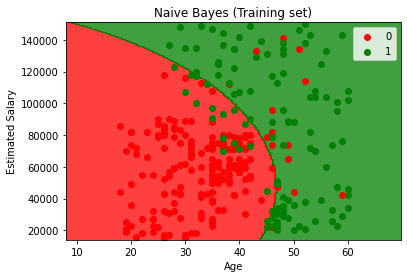
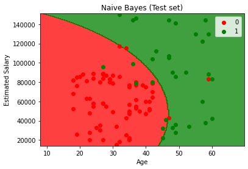

## What is Naive Bayes algorithm?

Naive bayes is a classification technique which relies on bayes theorem.
Bayes theorem provides an equation describing the relationship of conditional
probabilities of statistical quantities..In simple terms, a Naive Bayes classifier
assumes that the presence of a particular feature in a class is unrelated to the
presence of any other feature.

Let us understand this with an example. Consider a watermelon. What are the physical
features of a watermelon: green, round and huge. Considerably, these features describing
a watermelon depend on each other for their existence,all of these properties independently
contribute to the probability that this fruit selected at random is a watermelon.This is
why the term “Naive” is used.

Naive Bayes models are easy to build and can be used for initial verifications for large
datasets. Because of its simplicity, it is equally easy to explain the functionality or
working in the background. Before we dive into an example on how to use it in machine
learning. Let;s wrap our heads around the formula.

In Bayesian classification, we're interested in finding the probability of a target given
some observed features, which we can write as P(Target | features)

For computation,Bayes theorem can be written as :

P(Target | features) = P(features | Target ) x P(Target) / P(features)

And if we have two targets, say T1, T2, the computations can be represented as :

P(T1 | features) / P(T2 | features) = P(features | T1) x P(T1) / P(features) / P(features | T2) x P(T2) / P(features)

## When to use it?

Due to the naive assumption made, these models do not perform well on complex datasets.
However, below are few advantages of using this classification method

- They are extremely quick to train and make predictions.
- The Explainability score is very high.
- Very few parameters to tune and make the model perform better.
- They provide straightforward probabilistic prediction.

These advantages make the Naive Bayesian model a good baselines classification that is
easy to set up and takes very less training time. In situations described below, Naive
Bayes often outperforms other complex models in its simplicity :

- The naive assumptions correlate with the data.
- Well separated target attributes.
- High dimensional data, where model complexity is less important.

## Code it up!

scikit learn library provides us with three different types of Naive Bayes models:

- [Gaussian](http://scikit-learn.org/stable/modules/naive_bayes.html) : Used for classification, with assumption of normal distribution of features.
- [Multinomial](http://scikit-learn.org/stable/modules/naive_bayes.html) : Used for discrete counts.
- [Bernoulli](http://scikit-learn.org/stable/modules/naive_bayes.html) : Useful if your feature vectors are binary (i.e. zeros and ones). One application would be text classification with the ‘bag of words’ model where the 1s & 0s are “word occurs in the document” and “word does not occur in the document” respectively.

We consider the dataset, Social media Ads, which has two attributes: age and income
and a target with value [0,1] describing whether they bought the car or not.

```py
dataset = pdpp.read_csv('Social_Network_Ads.csv')
X = dataset.iloc[:, :-1].values
y = dataset.iloc[:, -1].values
```

Since the two attributes are of diverse values, we need to use StandardScaler.

```py
from sklearn.preprocessing import StandardScaler
sc = StandardScaler()
X = sc.fit_transform(X)
```

Splitting the dataset for training and testing.

```py
from sklearn.model_selection import train_test_split
X_train, X_test, y_train, y_test = train_test_split(X, y, test_size = 0.25, random_state = 0)
```

Importing the GaussianNB from Naive bayes model

```py
from sklearn.naive_bayes import GaussianNB
classifier = GaussianNB()
classifier.fit(X_train, y_train)
```

Let’s understand how our model performed.

```py
from sklearn.metrics import confusion_matrix, accuracy_score
cm = confusion_matrix(y_test, y_pred)
print(cm)
```

[[65  3] <br />
[ 7 25]]

```py
accuracy_score(y_test, y_pred)
```

0.9

Visualizing training set results of the model will help us understand the model behavior and decision

```py
from matplotlib.colors import ListedColormap
X_set, y_set = sc.inverse_transform(X_train), y_train
X1, X2 = np.meshgrid(np.arange(start = X_set[:, 0].min() - 10, stop = X_set[:, 0].max() + 10, step = 0.25),
                     np.arange(start = X_set[:, 1].min() - 1000, stop = X_set[:, 1].max() + 1000, step = 0.25))
plt.contourf(X1, X2, classifier.predict(sc.transform(np.array([X1.ravel(), X2.ravel()]).T)).reshape(X1.shape),
             alpha = 0.75, cmap = ListedColormap(('red', 'green')))
plt.xlim(X1.min(), X1.max())
plt.ylim(X2.min(), X2.max())
for i, j in enumerate(np.unique(y_set)):
    plt.scatter(X_set[y_set == j, 0], X_set[y_set == j, 1], c = ListedColormap(('red', 'green'))(i), label = j)
plt.title('Naive Bayes (Training set)')
plt.xlabel('Age')
plt.ylabel('Estimated Salary')
plt.legend()
plt.show()
```



```py
from matplotlib.colors import ListedColormap
X_set, y_set = sc.inverse_transform(X_test), y_test
X1, X2 = np.meshgrid(np.arange(start = X_set[:, 0].min() - 10, stop = X_set[:, 0].max() + 10, step = 0.25),
                     np.arange(start = X_set[:, 1].min() - 1000, stop = X_set[:, 1].max() + 1000, step = 0.25))
plt.contourf(X1, X2, classifier.predict(sc.transform(np.array([X1.ravel(), X2.ravel()]).T)).reshape(X1.shape),
             alpha = 0.75, cmap = ListedColormap(('red', 'green')))
plt.xlim(X1.min(), X1.max())
plt.ylim(X2.min(), X2.max())
for i, j in enumerate(np.unique(y_set)):
    plt.scatter(X_set[y_set == j, 0], X_set[y_set == j, 1], c = ListedColormap(('red', 'green'))(i), label = j)
plt.title('Naive Bayes (Test set)')
plt.xlabel('Age')
plt.ylabel('Estimated Salary')
plt.legend()
plt.show()
```



## Improving Naive Bayes

- Transform continious features into normal distribution.
- USe Laplace Estimator in cases of zero frequency problem.
- Focus on pre processing and feature selection to optimize the results of Naive Bayes.
- Do not spend time applying bagging boosting or ensemble method on Naive Bayes, as it has no variance to minimize.

I hope you found this article useful. To follow the code, I have created a [sample notebook](https://github.com/amankalra172/Classification/tree/master/Naive%20Bayes). Feel free to make a copy of the notebook for your experiments.
Do let me know if you have any questions!
