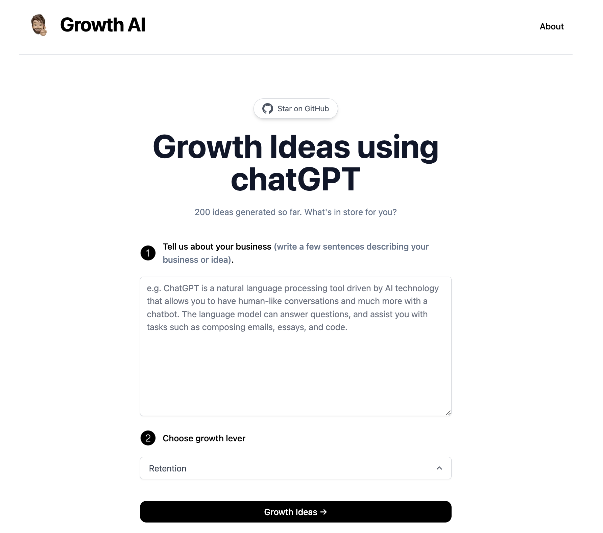

Hey there, entrepreneurs! Are you tired of trying to come up with growth ideas for 
your business? Do you wish there was an easier way to generate new ideas that are 
tailored to your specific needs? Well, you're in luck because we've created a 
website that does just that!

## [Slack](https://slack.com/)

Slack, as trite as it may seem, performs an excellent job! What distinguishes it is the amount of automation that is feasible. We employ zoom, Figma, Gdrive, and 3rd party alerts to make things simpler to examine, monitor, or work on! Slack's free version is adequate for small enterprises as well. The voice call function in channels can help to recreate the sensation of teams working together in the same room. Some teams find it useful to have a voice channel open throughout the day so that such spontaneous talks may continue. Yes, Slack may be noisy and overwhelming for some, but with self-discipline and compassionate communication, it's the most powerful and successful tool I use every day.

## [Zoom](https://zoom.us/)

I had no idea about zoom until the epidemic struck. I have the impression that I am not alone on this boat. Even in 2022, Zoom is the easiest and most dependable communication program I've used. Yes. Google Meet is great, but how often do you have problems sharing your screen? As a Remote Product Manager, I attend every single meeting through Zoom, so it's almost second nature to me. I've had to change the way I participate in meetings, but Zoom, in my perspective, makes it feel as natural as possible. While you may prefer alternative virtual meeting software, the ease of use of Zoom may make it a favored option for connecting with certain of your clients and team members.

## [Notion](https://www.notion.so/)

Before handling product management, I was a firm believer in Google Docs, Sheets, Slides, and all of the products that Google Workspace provides to its customers. However, shifting into utilizing Notion for practically all of my work was really straightforward. I immediately discovered Notion is one of the most adaptable “productivity” programs that I’ve ever used – one piece of software to capture meeting notes, create specifications, connect bits of data between pages and tables, and much more. I use Notion numerous times a day and truly look forward to the experience.

## [Otter.ai](https://otter.ai/)

Otter.ai is an intriguing service that lets me record (audio only) and transcribe critical meetings. One of several cool things about Otter.ai is the fact that it transcribes and indexes each meeting that you utilize it in. After a meeting is recorded, you can literally simply search for phrases to locate instances of where your search term was really stated in various sessions – it makes answering the “what precisely did we speak about in that meeting?” issue a lot simpler.

## [Jira](https://www.atlassian.com/software/jira)

Jira is a project management application designed for agile teams that must steer a product from wireframe through hard launch and beyond. Jira software features such as scrum boards, roadmaps, agile reporting, and customized workflow can help any product lifecycle management team. Jira features over 3000 third- and first-party applications that interface with the primary platform to offer additional functionality through the Atlassian Marketplace. Google Drive, Draw.io, Microsoft Teams, GitHub, Slack, and Balsamiq are a few examples.
