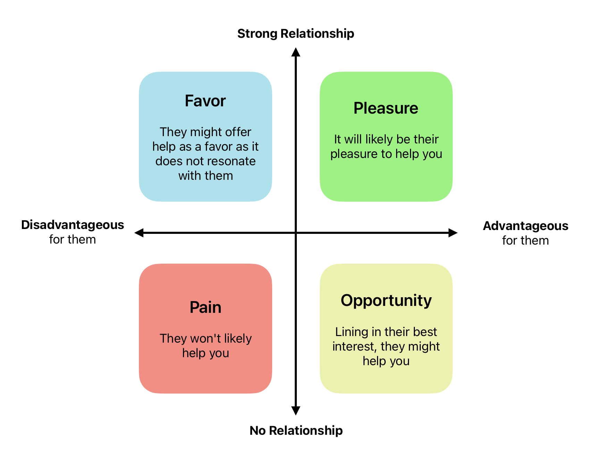

In a world often dominated by positional power and authority, the ability to influence others without the need for such trappings is a remarkable skill. 
This art of persuasion without power, often referred to as *“soft power”*, is a subtle yet transformative force that can shape thoughts, influence decisions, and drive collective action.

Unlike traditional authority, which relies on hierarchical structures and formal mandates, soft power stems from the inherent power of one’s character, 
communication, and relationships. It’s the ability to inspire others not through coercion or force, but through genuine connection, empathy, and a compelling vision. 
In this blog, I share a very interesting perspective of Advantage vs Relationship matrix, and aim to clearly demonstrate how different relationships and the advantage plays along. I learnt about this early in my career from [David Bencomo](https://www.linkedin.com/in/davidbencomojr/).

Your goal is too have more and more of your requests in the first quadrant, ideally the ones that brings pleasure to both of you. 

<Alert status="warning" title="Authority comes from role, but is often short lived.">

 It is a requirment that is gifted with your position, but can fade away and becomes difficult to get back!

</Alert>

Those who master the art of persuasion without power are often described as charismatic leaders, not because of their formal titles or positions, but because of their ability to connect with others on a deeper level. They exude a quiet confidence that draws people in, and they communicate with authenticity and passion, fostering a sense of trust and shared purpose. Effective persuasion without power hinges on several key principles. Let's talk about few of those!

#### Understanding the Human Psyche

Persuasion is not about manipulating others; it’s about understanding their perspectives, motivations, and concerns. By genuinely listening and empathizing with others, you can build rapport and establish a foundation for effective communication.

#### Compelling Storytelling

Stories have the power to capture attention, evoke emotions, and inspire action. Effective persuaders are master storytellers, weaving narratives that resonate with their audience and connect their ideas to shared experiences and values.

#### Focus on Relationships

Influence without power is built on relationships, not on fleeting interactions. By cultivating genuine connections with others, you create a network of trust and engagement that amplifies your influence. Sharing below few approaches to develop meaningful relationships. Please remember to conduct these practises with emapthy and real desire to know the other person.

1. Find commonalities with the other person; What do you have in common? 
2. Being an empthatical listener goes long way in building relationships. 
3. Asking questions and be curious. Learn from the other person and their experience.
4. Always show high EQ and low ego. A mantra that has been followed by the greatest leaders.

#### Expertise and Relevance

While charisma and storytelling are crucial, they alone are not enough. Persuasive leaders must also possess a depth of knowledge and expertise in their chosen field. This expertise lends credibility to their ideas and makes their messages more impactful. Building trust and establishing credibility can be done by practising and not just limiting. 

1. Be consistent
2. Honor responsiblities
3. Deliver results and repeat
4. Demonstrate expertise in your field

#### Authenticity and Integrity

In an age of transparency, authenticity is essential. True persuaders are genuine in their beliefs and intentions, and their words and actions align consistently. This authenticity builds trust and makes their influence more enduring. Other small tips that have been shared by majority is to build likability. 

1. Pay it forward with compliments (if someone is going thier extra mile, let them know; send an email to their manager.)
2. Corporate on mutual goals and help eavch other.
3. Use the [Law of Reciprocaity](https://www.oreilly.com/library/view/the-100-absolutely/9781576751077/9781576751077_ch07lev1sec13.html) 
4. Leverage the [Benajmin Franklin Effect](https://en.wikipedia.org/wiki/Ben_Franklin_effect) 

By cultivating genuine connections, communicating with empathy, and sharing your expertise with passion, 
you can inspire others to move in the same direction, creating a ripple effect of positive change.

<Alert status="info" title="Beyond Position: The art of influencing without authority">

The art of persuasion without power is not about seeking dominance or control; it’s about empowering others to join you in pursuing a shared vision. 

</Alert>

In a world where positional power is often fleeting, the ability to influence without authority becomes increasingly valuable. It’s a skill that can be honed and cultivated, allowing individuals to make a lasting impact on the world around them, not through force or coercion, but through the power of their character, communication, and relationships.