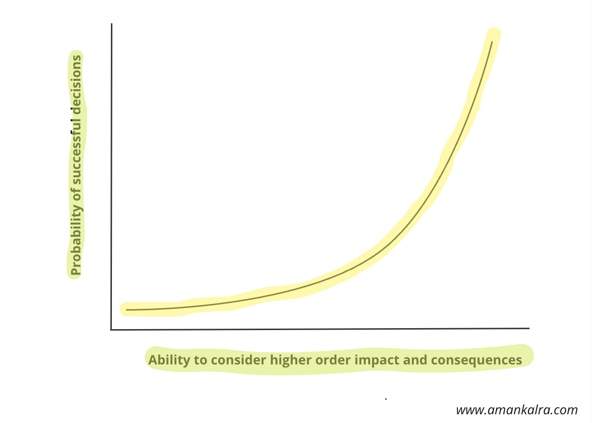

Let’s talk about how we think about problems. There are two ways: the quick, easy way and the deeper, more complex way. Howard Marks in his book [The Most Important Thing](https://www.goodreads.com/book/show/10454418-the-most-important-thing) calls these *"first-level"* and *"second-level"* thinking.

<Alert status="warning" title="The short falling of first-level thinking">

First-level thinking is like a snap decision. It’s quick, simple, and everyone does it. It’s like when you’re hungry and grab a chocolate bar without thinking about anything else.

</Alert>

But then, there’s second-level thinking. It’s more thoughtful and takes time. It’s about looking beyond the quick fix and thinking about what might happen next. For example, instead of just grabbing that chocolate bar every time you're hungry, second-level thinking asks, “What will happen if I keep eating this? Maybe I should choose something healthier.”

First-level thinking is easy because it's what most people do. But if you want to stand out and make better choices, second-level thinking is the way to go. It’s not about just following the crowd; it’s about seeing things differently.

Imagine a game of chess. First-level thinking might lead to obvious moves, but second-level thinking plans several steps ahead, anticipating how each move affects the game.

Second-level thinking helps you see the bigger picture. It’s not just about what happens now; it’s about what happens next and after that. 

## How to practise it?

Let’s explore, how we can introduce this framework in our everyday thinking! This can be done purely as a mental exercise or a miro board. 

Let’s say you’ve got a decision to make. First, think about what will happen right away if you make that choice—that's the first order.

Now, here’s the second-order thinking. For each of those immediate effects, ask yourself, *"And then what?"* This helps you see what might happen because of that choice. Keep asking this question for as long as it helps you understand more.

Another way to do this is by thinking about time. Consider what happens in the 

1. Short term: 10 minutes
2. Medium term: 10 months
3. Long term: 10 years

This way, you cover what happens right away and what happens later because of your decision. Note, the time period taken above is solely as a reference point. 

<Collapsible summary={<em>Access this easy template to make impactful decisions?</em>}>

You can use this [template](/second-order-thinking-template.pdf) everytime you are making a decision.

Simple to use, impactful at core!

</Collapsible>

The great thing about second-order thinking is that it works for big decisions, like buying a house, but also for small ones, like what you eat. It’s a tool that helps you see how your choices affect different parts of your life.

While first-level thinking might give everyone the same ideas, second-level thinking sets you apart. It’s the key to making smarter decisions and understanding how things connect in the world. It’s like having a superpower in a world where everyone else is sticking to the basics.