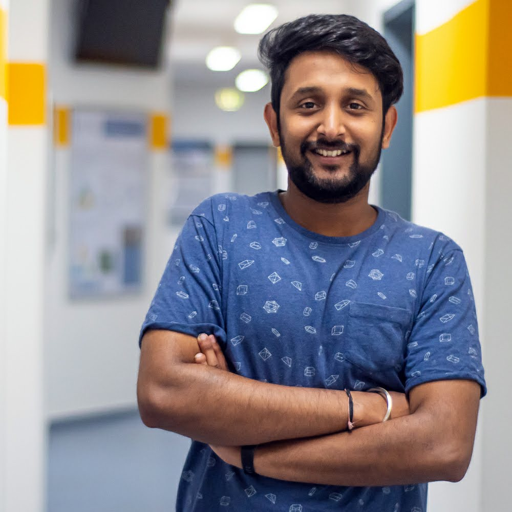

import { MDXLayout as PageLayout } from "../../components/blocks/mdx-layout"
import { SEO } from "../../components/seo"

<SEO
  title="About"
  description="A little bit about me and what I'm passionate about, what I do at work, and what else I do in my free time. Maybe you're also into photography or hiking?"
  noIndex
/>

export default PageLayout

# About

**Hi, I'm Aman 👋**  
I'm currently pursuing M.Sc in Digital Engineering at Otto-von-Guericke University, Magdeburg, Germany.   
My interests are deep-rooted in the field of product management and utilizing data for the betterment of consumers, social service, and entrepreneurship to explore various working aspects of the current dynamic world.

## What I'm passionate about

This personal website was made as a hobby project where I blog about different GitHub repositories that pricks my interest and solve real-life problems. I learned so much using free and open-source content that I wanted to contribute back 🎉 .

To know more about my work, scroll down. On the fun side, you can scroll through my Instagram page for thoughts, pictures, and emotions.

## Hobbies

If I'm not coding I'd like to spend my time with cycling or hiking in the mountains. I then often take my camera with me to take landscape photos and also particularly enjoy editing the photos at the computer afterwards. I also enjoy learning about different cultures and interacting with people of different countires.Lastly, my love for beer has been reignited since i moved to Germany.
