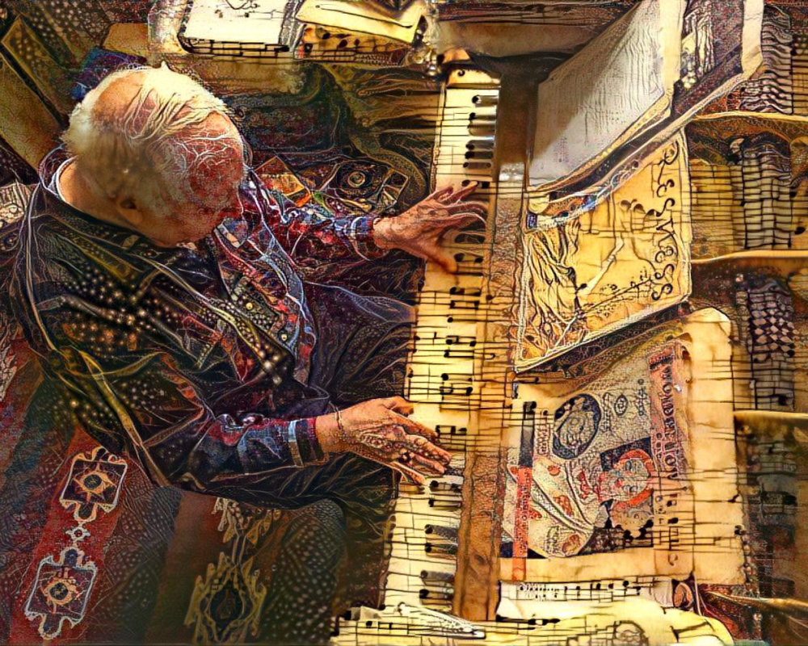
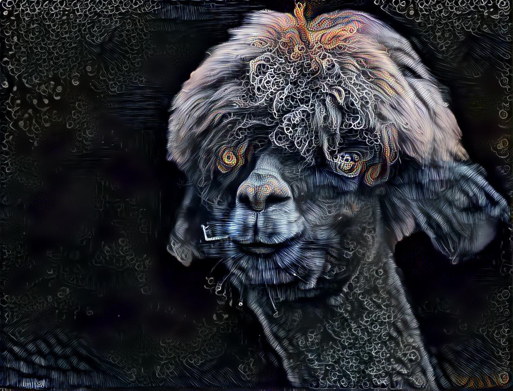

import { MDXLayout as PageLayout } from "../../components/blocks/mdx-layout"
import { SEO } from "../../components/seo"

<SEO
  title="NFTs"
  description="Besides software development I have another huge passion of mine: Designing UI in Figma, creating photo manipulations in Photoshop, tinkering with abstract art in Cinema4D, and exploring nature & capturing it with my Fujifilm camera. Or in other words: I enjoy art!"
  breadcrumbListItems={[{ name: `NFTs`, url: `/nfts` }]}
/>

export default PageLayout

# Non Fungible Token

Besides software development and management, I have acquired a huge interest in cryptocurrency and blockchain. One application that especially interests me is Non-fungible Token a.k.a NFTs. Currently, all my NFTs are up for display and buy on [Opensea](https://opensea.io/cryptominder). They are minted on the polygon network which is usually very cheap to mint on as compared to traditional ethereum networks which rely on huge gas fees. I am planning to write on how to mint your own first NFT in subsequent articles, so stay tuned.

Below are a few examples of NFTs I minted and added for sale.

I mint NFTs for passion and try to help my cause. I have been an active member of Lions International, an NGO doing wholesome good work for people around the world. Recently I contacted another NGO : [Ashray Akruti](https://ashrayakruti.org/) who is run by a bunch of beautiful souls working for people with disabilities in Education, Health, and Skill Development for the past 25 years. I have decided to donate a portion of my earnings via NFTs to these organizations.
